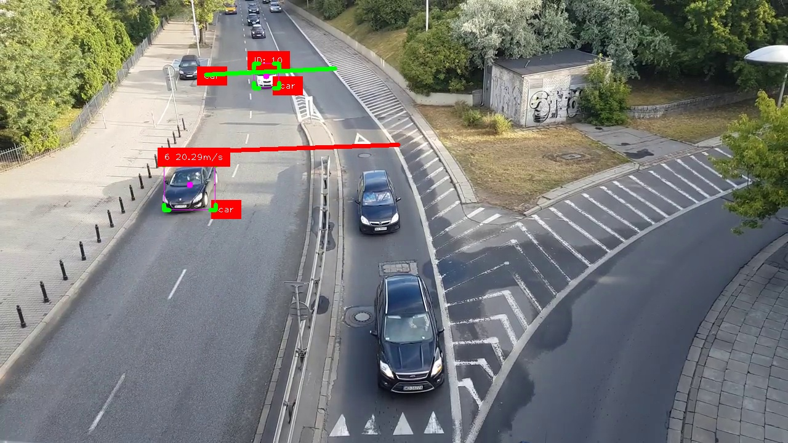

# Calculate Vehicle Speed In Video

Hi my name is `Moses Daudu` and I am a Machine Learning Engineer.

In this repo, You will see how to calculate vehicles speed in a given video.

## Step 1:
Install all requirements
`pip install -r requirements.txt`

## Step 2:
Edit the `FILE_PATH` argument in line 7 and input the path to the video you want to use
Edit the limit figures to be specific to your use case in line 28 and 29

## Step 3:
Run the `python` file

Contact Moses at `mosesdaudu001@gmail.com` for adjustments to suit your needs.

### Side Notes:
1. I used masks to improvve the efficiency of the detector. But as I'm sure that you are already aware that masks are specific to the video and so you would need your own customly made masks.
2. Please note that I used the object path for my local computer, ensure to use yours to avoid problems

